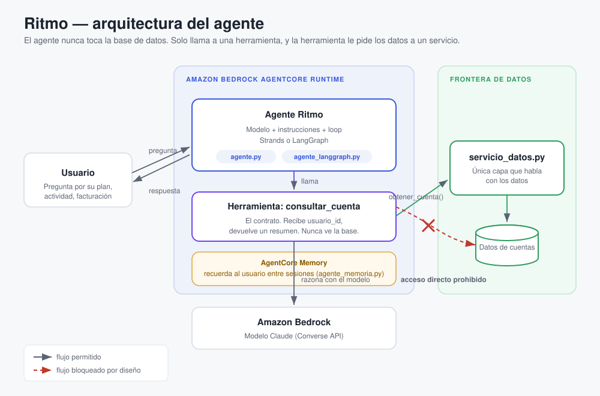

# Ritmo — agente de una plataforma de streaming de música

Proyecto de demostración para el video de **Amazon Bedrock AgentCore**: cómo llevar un agente de IA de tu laptop a producción.

Ritmo es el asistente de una plataforma de streaming de música. Responde dudas de la cuenta del usuario: su plan, cuántas horas ha escuchado, cuándo se le renueva. El recorrido del video va de un agente que corre en local a uno desplegado, con memoria, observable, y que funciona con más de un framework.

## La decisión de diseño que hila todo

El agente **nunca toca la base de datos directamente**. No tiene el connection string, no arma consultas, no tiene credenciales de la base.

En su lugar, el agente llama a una herramienta (`consultar_cuenta`), y esa herramienta le pregunta a un servicio interno (`servicio_datos.py`) que es el único que habla con los datos. El agente solo ve el contrato de la herramienta: qué le pide y qué recibe.

Por qué:

- Un modelo generando consultas contra tu base de producción a partir de texto de usuario es una superficie de ataque, no una funcionalidad.
- El agente corre aislado en un entorno gestionado. Darle credenciales de base rompe ese aislamiento.
- La herramienta es el contrato, no la base. Por eso el mismo agente sirve para Strands o LangGraph sin cambios, y por eso escala a AgentCore Gateway cuando el acceso a datos crece.

## Arquitectura



El usuario habla con el agente (Strands o LangGraph) que corre en AgentCore Runtime. El agente razona con un modelo de Amazon Bedrock y, cuando necesita datos de la cuenta, llama a la herramienta `consultar_cuenta`. Esa herramienta es el único camino hacia `servicio_datos.py`, que a su vez es la única capa que toca los datos. El acceso directo del agente a la base está bloqueado por diseño.

## Estructura

| Archivo | Rol |
|---|---|
| `servicio_datos.py` | La única capa que habla con los datos. El agente nunca la importa; solo la herramienta la llama. |
| `agente_local.py` | El agente de Strands **puro**, sin una sola línea de AgentCore. Corre en tu laptop con un loop de chat. Es el "antes" del video. |
| `agente.py` | El **mismo** agente que `agente_local.py`, más las cuatro líneas de AgentCore. Idéntico por dentro; solo se le agrega la puerta de entrada para producción. Se mantiene limpio (sin memoria) para que la comparación lado a lado sea exacta. |
| `agente_memoria.py` | El mismo `agente.py` con AgentCore Memory añadida. Ritmo recuerda al usuario entre sesiones. |
| `agente_langgraph.py` | La misma idea con LangGraph. Mismo entrypoint, mismo deploy, misma herramienta. Solo cambia cómo se construye el agente. |
| `crear_memoria.py` | Script de una sola vez para crear el recurso de AgentCore Memory y obtener su ID. |
| `setup.sh` | Prepara el entorno: crea el venv e instala las dependencias. |
| `requirements.txt` | Dependencias del agente de Strands. |
| `requirements-langgraph.txt` | Dependencias de la variante de LangGraph. |

Las dos versiones del agente (`agente_local.py` y `agente.py`) tienen por dentro el mismo modelo, las mismas instrucciones y la misma herramienta. La única diferencia son las cuatro líneas de AgentCore. Compararlas lado a lado es el punto del video.

## Preparar el entorno

Necesitas Python 3.10+ y credenciales de AWS con acceso a Bedrock (modelo Claude habilitado en tu región).

```bash
./setup.sh              # solo el agente de Strands
./setup.sh --langgraph  # además, las dependencias de LangGraph

source .venv/bin/activate

# Credenciales de AWS por variables de entorno (nunca en el código):
export AWS_REGION=us-west-2
# (y tus credenciales de AWS)
```

## Correr el agente local (sin AgentCore)

```bash
python agente_local.py
```

Escribe una pregunta como "¿Cuántas horas he escuchado este mes?" y verás en la consola la llamada a la herramienta antes de la respuesta. Escribe `salir` para terminar. Este agente solo vive mientras la terminal esté abierta.

## Correr el agente con AgentCore (local, antes de desplegar)

```bash
python agente.py
```

Levanta el servidor de AgentCore en el puerto 8080. En otra terminal:

```bash
curl -X POST http://localhost:8080/invocations \
     -H "Content-Type: application/json" \
     -d '{"prompt": "¿Qué plan tengo?"}'
```

## Desplegar a AgentCore

```bash
pip install bedrock-agentcore-starter-toolkit

agentcore configure --entrypoint agente.py
agentcore launch
agentcore invoke '{"prompt": "¿Qué plan tengo?"}'
```

`configure` empaqueta el agente, `launch` lo publica en AgentCore Runtime y devuelve el ARN, `invoke` lo llama ya desplegado.

## Memoria (Parte 4 del video)

La memoria vive en su propio archivo, `agente_memoria.py`, para no cargar `agente.py` (que es el de la comparación y el deploy). Primero crea el recurso de memoria una vez:

```bash
python crear_memoria.py
# copia el ID que imprime
export RITMO_MEMORY_ID=<el-id>
```

Con `RITMO_MEMORY_ID` en el entorno, corre el agente con memoria:

```bash
python agente_memoria.py
```

Ritmo recuerda el hilo de la conversación entre sesiones. Ojo: esto es distinto de los datos de la cuenta (que viven en `servicio_datos.py`). Uno es quién es el usuario, el otro es qué se han dicho.

## Nota de seguridad

Las credenciales de AWS van por variables de entorno, nunca en el código ni en el repo. El `.gitignore` ya excluye `.env`, llaves y artefactos del deploy. Después de grabar, limpia los recursos de AWS (runtime, repositorio de ECR, rol de IAM, recurso de memoria).
